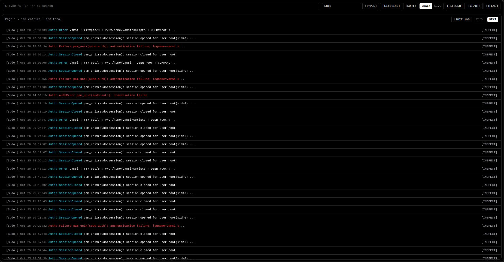
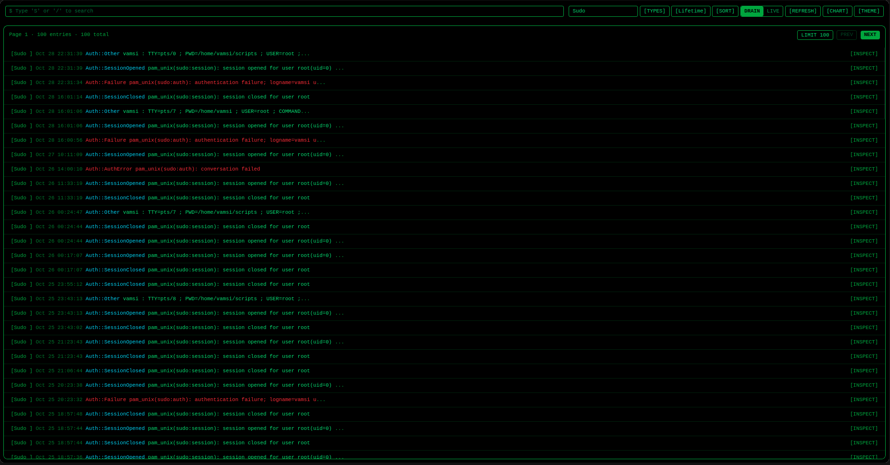
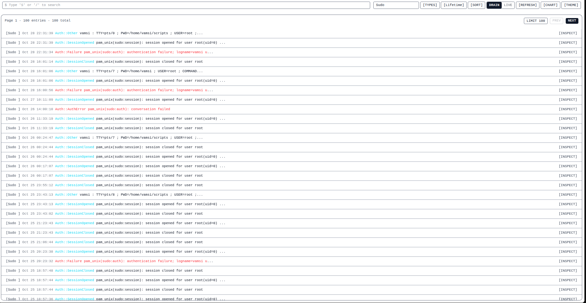
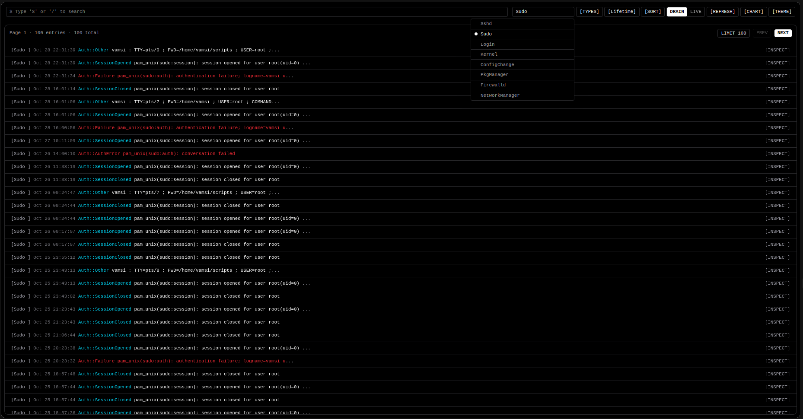
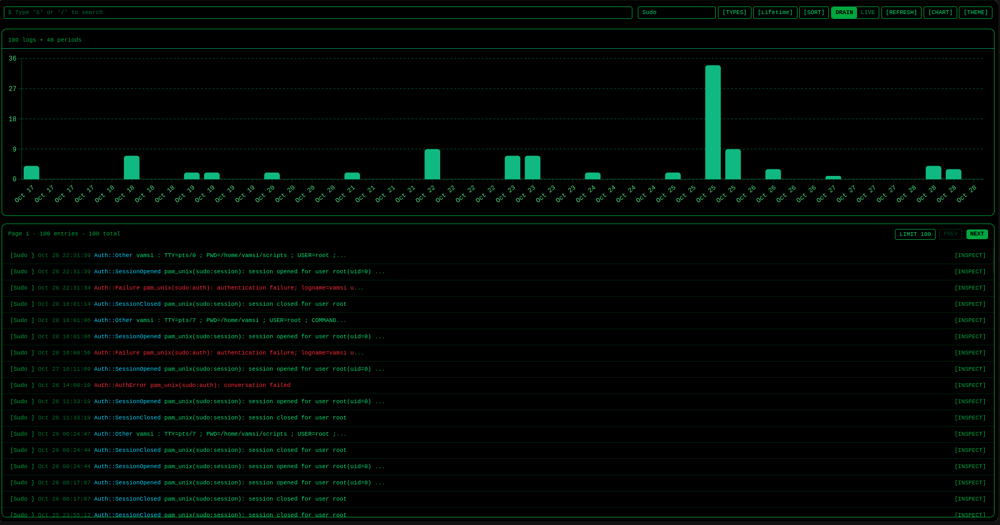
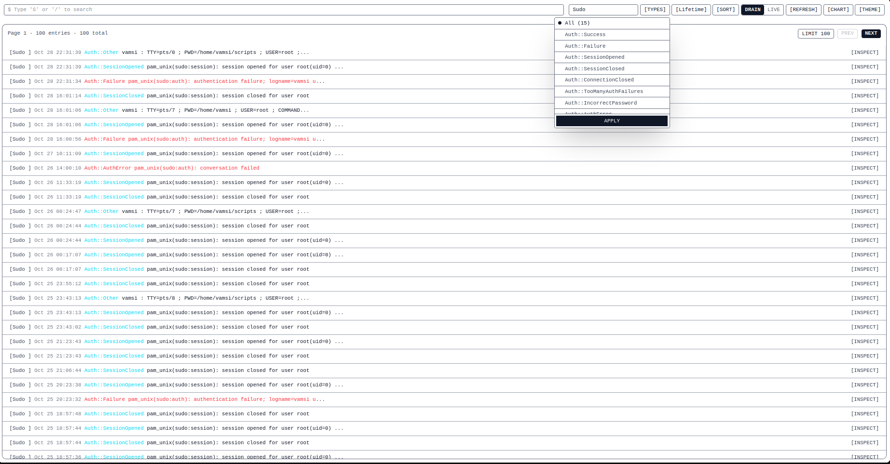

# Drashta

**Drashta** (meaning *“The Seer”*) is a Linux security tool that monitors and streams real-time, security-relevant events from your machine.

It parses **journald logs** using **regex patterns** across critical system services such as:

- **SSHD**
- **SUDO**
- **KERNEL**
- **NetworkManager**
- **Firewalld**
- **Cron**
- **User Sessions**

It converts these raw logs into structured events and streams them to a web UI using **Server-Sent Events (SSE)** for real-time visualization.

# Features

### Backend (Rust + Axum)
- Axum-based HTTP server  
- Real-time event broadcast via `GET /live` (SSE)
- Fully structured JSON API
- Uses **tokio** + broadcast channels for live updates
- Modular event parsers for each system service

### Frontend (React + Vite + TailwindCSS)
- Reactive real-time UI
- Live security event stream
- TailwindCSS-based minimal interface

# Installation

### Rust Toolchain Requirement

This project requires the latest stable Rust toolchain (rustc + cargo) with support for the Rust 2024 edition.

Install rustup (official installer):

```bash
curl --proto '=https' --tlsv1.2 -sSf https://sh.rustup.rs | sh
```

Update to the latest stable toolchain:

```bash
rustup self update
rustup update stable
rustup default stable
```

Ensure cargo bin directory is in PATH (if not already):

```bash
export PATH="$HOME/.cargo/bin:$PATH"
```

Verify:

```bash
rustc --version
cargo --version
```
### System Dependencies (Required)

This project uses **libsystemd** for reading journald logs. Install the required system packages before building:

**Ubuntu / Debian**
```bash
sudo apt update
sudo apt install pkg-config libsystemd-dev
```

**Fedora**
```bash
sudo dnf install pkgconfig systemd-devel
```

**RHEL / CentOS / Amazon Linux**
```bash
sudo yum install pkgconfig systemd-devel
```

**Arch Linux**
```bash
sudo pacman -S pkgconf systemd
```

### Frontend Requirements (Node + npm + Vite)

The frontend uses React + Vite.

Install Node.js:

Ubuntu / Debian:

```bash
sudo apt update
sudo apt install nodejs npm
```

>Note: Ubuntu’s default repo may have older versions. If you want the latest LTS:

```bash
curl -fsSL https://deb.nodesource.com/setup_lts.x | sudo -E bash -
sudo apt install -y nodejs
```

Arch Linux:
```bash
sudo pacman -S nodejs npm
```

Fedora:
```bash
sudo dnf install nodejs npm
```

Verify installation:
```bash
node -v
npm -v
```

# Setup 

```bash
git clone https://github.com/vamsi200/Drashta
cd Drashta/
chmod +x build.sh
./build.sh

```

After the server starts, we could access the UI `https://localhost:3200/app/`
> Note: The server would be started with the default port: `3200`, you could change this with `--port` option.

> ./target/release/drashta --port 1234 

 
# API ENDPOINTS
```bash
GET /live?event_name=<name.events>&limit=<n>
  Streams real-time events via SSE.

GET /drain?event_name=name.events&limit=<n>
  Returns the most recent events.

GET /older?event_name=<name.events>&cursor=<cursor>&limit=<n>
  Fetches logs newer than the given cursor.

GET /previous?event_name=<name.events>&cursor=<cursor>&limit=<n>
  Fetches logs older than the given cursor.

```
## UI Overview

The UI is designed to provide clear, real-time visibility into security-relevant system activity.

### Themes
- Dark
- Light
- Hecker(emerald)

### Viewing Modes
- **Live Mode**  
  Streams events in real time using Server-Sent Events (SSE).
- **Drain Mode**  
  Used for inspecting historical logs.

### Filtering & Analysis
- Filter by event source (SSHD, SUDO, Kernel, etc.)
- Filter by event subtype (e.g. `Auth::Success`, `Auth::Failure`)
- Filter by time and date ranges
- Full-text search across logs
- Interactive charts for visualizing activity patterns
- Inspect to get the raw log entry


## Screenshots








# LICENSE
This project is open source and available under the MIT License.
